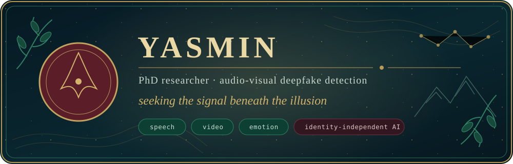

### Welcome to my corner of the map.

I’m **Yasmin**, a PhD researcher in Electrical and Computer Engineering at Toronto Metropolitan University. I study the signals left behind when audio or video is manipulated—and how to stop detection models from taking the easy route by memorizing identities.

> **My guiding rule:** learn the artifact, not the person.

#### The research trail

- 🎧 **Synthetic speech** — detecting generated and manipulated audio
- 🎞️ **Audio-visual forensics** — reasoning across sound and vision
- 🧭 **Identity independence** — finding and reducing identity shortcuts
- 🌍 **Generalization** — testing beyond one dataset or familiar conditions
- 🧠 **Emotion and representation learning** — exploring complementary signals responsibly

#### From the archive

**A Survey on Speech Deepfake Detection**  
*ACM Computing Surveys*, 2025 · [DOI: 10.1145/3714458](https://doi.org/10.1145/3714458)

#### Tools carried along the way

`Python` · `PyTorch` · `Hugging Face` · `wav2vec 2.0 / XLS-R` · `audio signal processing` · `computer vision` · `representation learning`

#### Elsewhere

[Academic website](https://yasamanadl94.github.io/) · [Google Scholar](https://scholar.google.com/citations?user=V6eIVVYAAAAJ&hl=en) · [LinkedIn](https://www.linkedin.com/in/yahmadiadli/) · [ORCID](https://orcid.org/0000-0003-0740-9557)

Toronto, Canada · Following artifacts, questioning shortcuts, and occasionally negotiating with GPUs.
