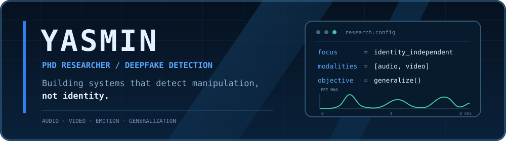

<div align="center">



</div>

## Profile

I’m **Yasmin**, a PhD researcher in Electrical and Computer Engineering at Toronto Metropolitan University. I design and evaluate deepfake detection systems that identify manipulation signals without relying on speaker or facial identity as a shortcut.

```python
research = {
    "focus": "identity-independent deepfake detection",
    "modalities": ["audio", "video", "emotion"],
    "priority": "generalization beyond familiar datasets",
}
```

## Current role

**AI Engineer · Blue Raven**  
Permanent part-time · 2025 to present  
AI-native company focused on preventing financial fraud.

## Research areas

- **Synthetic speech detection:** Identifying generated and manipulated audio
- **Audio-visual forensics:** Reasoning across sound and vision
- **Identity independence:** Measuring and reducing identity leakage
- **Cross-dataset generalization:** Evaluating models under unfamiliar conditions
- **Emotion and representation learning:** Studying complementary detection signals

## Selected publication

**A Survey on Speech Deepfake Detection**  
*ACM Computing Surveys*, 2025 · [DOI: 10.1145/3714458](https://doi.org/10.1145/3714458)

## Technical stack

`Python` · `PyTorch` · `Hugging Face` · `wav2vec 2.0 / XLS-R` · `audio signal processing` · `computer vision` · `representation learning`

## Links

[Academic website](https://yasamanadl94.github.io/) · [Google Scholar](https://scholar.google.com/citations?user=V6eIVVYAAAAJ&hl=en) · [LinkedIn](https://www.linkedin.com/in/yahmadiadli/) · [ORCID](https://orcid.org/0000-0003-0740-9557)

<sub>Toronto, Canada · Researching artifacts, representations, and robust detection systems.</sub>
