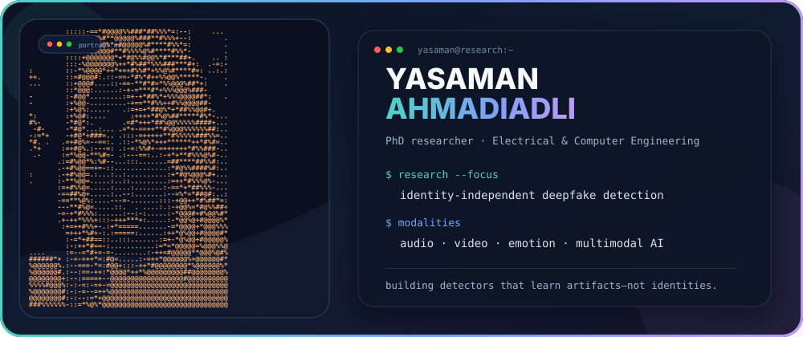

<div align="center">



</div>

I am a PhD researcher in Electrical and Computer Engineering at Toronto Metropolitan University, working on **identity-independent deepfake detection**. My research asks a simple but important question: can a detector learn the traces of manipulation without quietly learning who the person is?

My work spans audio and video, with a current emphasis on speech deepfakes, emotion-aware representations, cross-dataset generalization, and measuring identity leakage in learned features.

### Research focus

```text
deepfake detection     ████████████████████  audio + video
identity independence  ███████████████████░  representation learning
emotion & speech       ████████████████░░░░  affective cues
generalization         ██████████████████░░  cross-dataset evaluation
```

- Detecting synthetic and manipulated speech across speakers and datasets
- Separating manipulation cues from speaker-identity shortcuts
- Using emotion and linguistic information without turning identity into the signal
- Evaluating models beyond a single benchmark or a single “best” checkpoint

### Selected publication

**A Survey on Speech Deepfake Detection**  
ACM Computing Surveys, 2025 · [DOI: 10.1145/3714458](https://doi.org/10.1145/3714458)

### Research stack

`Python` · `PyTorch` · `Hugging Face` · `wav2vec 2.0 / XLS-R` · `audio signal processing` · `computer vision` · `representation learning`

### Current direction

```python
objective = {
    "detect": "manipulation artifacts",
    "avoid": "speaker identity shortcuts",
    "generalize": "across datasets and unseen conditions",
}
```

<sub>Toronto, Canada · Open to research conversations on trustworthy audio-visual AI and deepfake detection.</sub>
